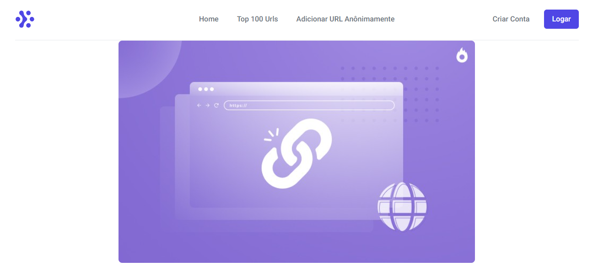
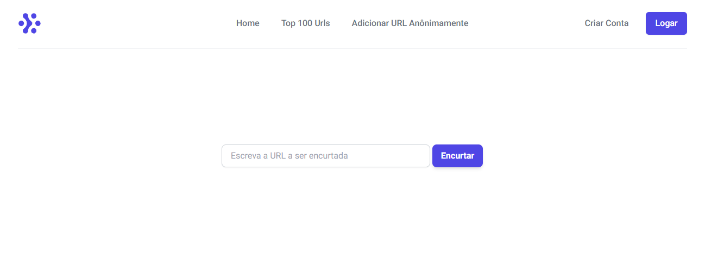
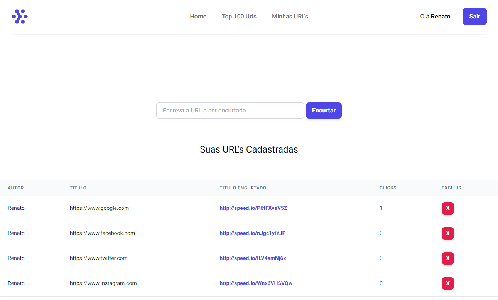
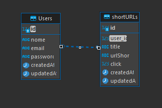

<h1 align="center">
    Encurtador de Links
</h1>

<p align="center">
 <a href="#-sobre-o-projeto">Sobre</a> •
 <a href="#-funcionalidades">Funcionalidades</a> •
 <a href="#-layout">Layout</a> • 
 <a href="#-como-executar-o-projeto">Como executar</a> • 
 <a href="#-tecnologias">Tecnologias</a>
</p>

## 💻 Sobre o projeto

O encurtador de link faz parte do processo seletivo da Speedio para Desenvolvedor Front-End na etapa de teste técnico.

Projeto composto por Frontend, Backend e Banco de dados.

---

## ⚙️ Funcionalidades

- [x] Usuários podem se cadastrar na plataforma enviando:

  - [x] Nome
  - [x] Email
  - [x] Password

- [x] Para o cadastro de URL's, podem ser feitos da seguinte maneira:

  - [x] Usuário cadastrado:

    - Logar na aplicação e posteriormente enviar o link que deseja encurtar.

  - [x] Usuário não cadastrado:

    - Acessar a aba de adicionar anônimamente e posteriormente enviar o link que deseja encurtar.

- [x] Usuários cadastrados podem excluir URL's criadas pelo mesmo.
- [x] A cada acesso as URL's é adicionado um click a mesma e a ranqueando no TOP 100 URL's.

---

## 🎨 Layout

O layout da aplicação:

### Web

<p align="center" style="display: flex; align-items: flex-start; justify-content: center;">

## Home

  

## Top 100 Urls

  

## Adicionar URL anônimamente

  

## Usuario Logado

  

</p>

---

## 🚀 Como executar o projeto

Este projeto é divido em duas partes:

1. Backend
2. Frontend

💡O Frontend precisa que o Backend esteja sendo executado para funcionar.

### Pré-requisitos

Antes de começar, você vai precisar ter instalado em sua máquina as seguintes ferramentas:
[Git](https://git-scm.com), [Node.js](https://nodejs.org/en/), [Docker](https://www.docker.com).

Além de um editor de código como o [VSCode](https://code.visualstudio.com/).

Para visualização do banco de dados recomendo a utilização do [DBeaver](https://dbeaver.io/download/).

#### 🎲 Rodando o Backend (servidor) e a Aplicação Web (Frontend)

> Configure o DBeaver de acordo com o arquivo [config.json](https://github.com/tgmarinho/README-ecoleta-----/BackEnd/api/config/config.json)

```bash
# Clone este repositório
$ git@github.com:RenatoAlbuquerque/Aplicacao_shortURL.git
# Crie um container no Docker com o comando abaixo
$ docker run --name postgres -e POSTGRES_PASSWORD=postgres -p 5432:5432 -d postgres
# Verifique se o container esta em execução
$ docker ps
# Acesse a pasta do projeto no terminal/cmd
$ cd Aplicacao_shortURL
# Instale as dependências
$ npm install
# Execute a aplicação
$ npm start
# O servidor iniciará na porta:3333 - acesse http://localhost:3333
# A aplicação iniciará na porta:3000 - acesse http://localhost:3000
# O banco de dados utilizara a porta:5432
```

---

## 🛠 Tecnologias

As seguintes ferramentas foram usadas na construção do projeto:

<table text-align="center">
    <tr>
    <th>Arquitetura</th>
    <th>Back-end</th>
    <th>Banco de dados</th>
    </tr>
    <tr>
    <td>
      <h5>Padrão MVC</h5>
    </td>
    <td>
      
      
      
    </td>
    <td> </td>
    </tr>
</table>

#### **Diagrama Relacional do Banco de dados**

  

#### **Website** ([React](https://reactjs.org/))

- **[Axios](https://github.com/axios/axios)**
- **[Cypress](https://www.cypress.io)**
- **[Js-cookie](https://www.npmjs.com/package/js-cookie)**
- **[React Router Dom](https://github.com/ReactTraining/react-router/tree/master/packages/react-router-dom)**
- **[Sass](https://www.npmjs.com/package/sass)**
- **[SweetAlert2](https://sweetalert2.github.io/#download)**
- **[TailwindCSS](https://tailwindcss.com)**

> Veja o arquivo [package.json](https://github.com/tgmarinho/README-ecoleta/blob/master/web/package.json) -- fazer

#### [](https://github.com/tgmarinho/Ecoleta#server-nodejs--typescript)**Server** ([NodeJS](https://nodejs.org/en/) + [Sequelize](https://sequelize.org/v6/))

- **[Bcryptjs](https://www.npmjs.com/package/bcrypt)**
- **[Body-parser](https://www.npmjs.com/package/body-parser)**
- **[CORS](https://expressjs.com/en/resources/middleware/cors.html)**
- **[Express](https://expressjs.com/)**
- **[JWT](https://www.npmjs.com/package/jsonwebtoken)**
- **[Nodemon](https://www.npmjs.com/package/nodemon)**
- **[Path](https://www.npmjs.com/package/path)**
- **[Pg](https://www.npmjs.com/package/pg)**

> Veja o arquivo [package.json](https://github.com/tgmarinho/README-ecoleta/blob/master/server/package.json) -- fazer

**Utilitários**

- Teste de API: **[Insomnia](https://insomnia.rest/)**

**Link do Video de Apresentação**

- **[Aqui](https://drive.google.com/file/d/1BTiFovXaBFxufKU_6ZzraodzOTecKqvg/view?usp=sharing)**

#### 🎲 Execucação de Testes e2e

> Faço o dowload do [Cypress](https://www.cypress.io) em sua máquina ou:

```bash
# Acesse o projeto e execute a linha de comando abaixo
$ npm install cypress
```

```bash
# Acesse a pasta do projeto
$ cd FrontEnd
# Execute os teste de 2 modos
# Obervação: Por um dos teste ser criação de usuário préviamente configurado, ira dar sucesso apenas a 1ª vez em que for rodado, visto que o registro na próxima vez já estará sendo usado.
# Apenas linha de comando
$ npm run e2e
# Com interface
$ npm run cy:open
```
